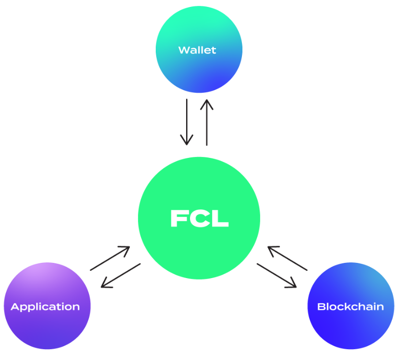

# flow-codes
learn flow with codes
项目的第一个大阶段的目标是实现一个NFT收藏品平台，最终的页面可以[参见这里](https://flow-codes.vercel.app/).

本课程假设开发者已经对前端开发，尤其是React框架已经很熟悉。

本次的目标是实现前端与FLow的钱包连接。

# Flow客户端库FCL (Flow Client Library)
Flow为开发者构建了非常方便的开发体验，其中一个重要的就是提供了FCL这个开发库，它具备自动发现项目方接入的钱包接口的功能。如下图,FCL作为枢纽与钱包、DAPP和区块链交互，免去了在代码中保存秘钥可能存在的风险。

我们通过简单的几行代码就可以实现钱包的连接功能，并在我们的前端木板上展示

## Step 1
创建 `/src/config/config.js`
分别添加flow的测试网节点和钱包发现的网络配置

```
import {config} from "@onflow/fcl"

config({
    "accessNode.api": process.env.REACT_APP_ACCESS_NODE,
    "discovery.wallet": process.env.REACT_APP_WALLET_DISCOVERY
})
```

并在 `src/index.js`中加载该配置

```
import './config/config'
```

## Step 2

在`src\hooks\use-current-user.hook.js`中建立fcl库的钱包连接和取消连接的hook

```
import * as fcl from '@onflow/fcl'

export default function useCurrentUser() {
  const [user, setUser] = useState({ loggedIn: false })

  const tools = {
    logIn: fcl.authenticate,
    logOut: fcl.unauthenticate,
  }

  useEffect(()=>{
    fcl.currentUser().subscribe(setUser)
  }, [])


  return [user, user?.addr != null, tools]
}
```

Have fun!

# 运行

- Linux: `sh run.sh`
- Win: 在gitbash打开 `sh run.sh`

# 希望你能学会
- authenticate users with a blockchain wallet
- query blockchain data with scripts
- interact with smart contracts by using transactions
- write, test and deploy your own smart contracts
- and sell your own digital assets by integrate easy payment onramps and a marketplace to your application
