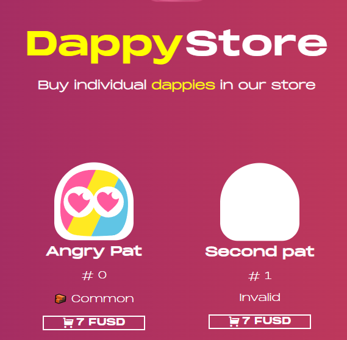

# flow-codes
learn flow with codes
项目的第一个大阶段的目标是实现一个NFT收藏品平台，最终的页面可以[参见这里](https://flow-codes.vercel.app/).

本课程假设开发者已经对前端开发，尤其是React框架已经很熟悉。

> 本次的目标是使用FCL开发第一个脚本来**读取**FLow链上数据,并用于替换`src\hooks\use-dappy-templates.hook.js`中`generateDappies`写死的数据。

# 第一个FCL脚本

Flow的调用合约的代码分为脚本(scripts)和交易(transction)两种，他们都是采用强类型且内存安全的Cadence语言编写，但是脚本只能读取链上状态，而交易可以提交能修改链上状态的交易。

本节我们使用脚本来读取已经部署好的链上合约数据，合约地址配置在`run.sh`中的`DAPPY_CONTRACT`，测试网代码[戳这里](https://flow-view-source.com/testnet/account/0xccb1fd9e1468b2e8/contract/DappyContract),下一节我们会采用自己部署的合约。

## 配置链上合约地址
首先在`run.sh`中修改API和合约地址，注意如果ACESS_API设置为上节的`https://rest-testnet.onflow.org`会出现跨域报错:

```
export ACCESS_API=https://rest-testnet.onflow.org
export WALLET_DISCOVERY=https://fcl-discovery.onflow.org/testnet/authn
export FT_CONTRACT=0x9a0766d93b6608b7
export FUSD_CONTRACT=0xe223d8a629e49c68
export DAPPY_CONTRACT=0xccb1fd9e1468b2e8
```

在 `/src/config/config.js`中配置合约的假名

```
config({
    "accessNode.api": process.env.REACT_APP_ACCESS_NODE,
    "discovery.wallet": process.env.REACT_APP_WALLET_DISCOVERY,
    "0xDappy": process.env.REACT_APP_DAPPY_CONTRACT,
})
```


## 编写FCL前端调用合约
创建`src/flow/list-dappy-template.script.js`文件。
FCL前端调用实际上调用的是Cadense语言的脚本，他的基本规范是会执行下面代码中的`main()`函数，并返回我们上述配置好的合约里的`DappyContract.listTemplates()`，其返回值类型是`{UInt32: DappyContract.Template}`。
```
export const LISRT_DAPPY_TEMPLATES = `
import DappyContract from 0xDappy  //引入部署好的合约

pub fun main(): {UInt32: DappyContract.Template}{
    return DappyContract.listTemplates()
}
```

## 实现前端调用
只需要调用FCL的query函数即可。
引入上述`list-dappy-template.script.js`合约和FCL的`query`函数,并在 `src\hooks\use-dappy-templates.hook.js`中把原来的`res`替换为下面的代码实现调用:
```
import {query} from "@onflow/fcl"

import {LISRT_DAPPY_TEMPLATES} from "../flow/list-dappy-template.script"
...
    let res = await query({
        cadence: LISRT_DAPPY_TEMPLATES,
    })

```

## Have fun!访问
访问http://localhost:3000/dappies,就能看到两个小图片啦!


# 运行

- Linux: `sh run.sh`
- Win: 在gitbash打开 `sh run.sh`

# 希望你能学会
- authenticate users with a blockchain wallet
- query blockchain data with scripts
- interact with smart contracts by using transactions
- write, test and deploy your own smart contracts
- and sell your own digital assets by integrate easy payment onramps and a marketplace to your application
