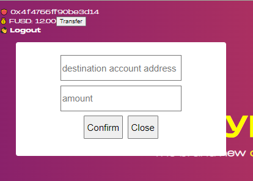

# flow-codes
learn flow with codes
项目的第一个大阶段的目标是实现一个NFT收藏品平台，最终的页面可以[参见这里](https://flow-codes.vercel.app/).

本课程假设开发者已经对前端开发，尤其是React框架已经很熟悉。

> 本次的目标是学习FUSD合约的创建，类似于以太坊的ERC20合约，这有助于后面实现Dappy的合约。

# 创建BasicToken合约
Cadence合约与Solidity不同之处在于，其数据（也即资源)其实存储在用户的个人目录下，而非以太坊的公共账本，并且只有本人有权限来操作这些资源。资源其实类似于一个struct，他有自己的变量和函数，只是资源只能被资源拥有者操作，且不能被复制，只能被转移或销毁。因此带来了一下好处：
- 账户是去中心化的不依赖账本，这可允许并鼓励用户删除无用数据，防止区块链状态爆炸
- 权限管理更为简单，不需要检查`msg.sender`就可以确保资源的操作权限
- 单个用户的合约风险，不会牵扯到整个以太坊公共账本影响的用户
- 没有整数溢出风险
- 资产不能被复制，因此很难丢失、被盗或被销毁，不会被可重入攻击
- FLow保证了没有生成资源地址或正确实现接受资源函数的交易会被revert，因此也不会出现转入一个错误地址丢失资产的风险

那么问题是如何实现ERC20合约那样的mapping使得用户地址和balance映射起来，并实现资产的转移？

答案是采用`Vault`资源，每一个用户通过引入该`Vault` 合约并创建该资源存到自己的目录下，就相当于建立了address和balance的映射。转移资产则比较复杂，由于不能在公共账本上操作balance，且资源不能被复制，因此转账时需要将自己账户的余额减去转账的`amount`再创建该`amount`的`Vault`资源，转移给接收人。听起来比较复杂？看如下的代码吧：
创建cadence\contracts\BasicToken.cdc文件，写入:
```
pub contract BasicToken {
    pub resource Vault {
        pub var balance: UFix64;
        init(_balance:UFix64){
            self.balance = _balance;
        }

        pub fun deposit(from:@Vault) {  //接受转账
            self.balance = self.balance + from.balance;
            destroy  from;
        }

        pub fun withdraw(amount: UFix64) : @Vault {   //准备转账给其他人
            self.balance = self.balance - amount
            return <- create Vault(_balance: amount)
        }
    }

    pub fun createVault(): @Vault{
        return <-create Vault(_balance: 30.0)
    }

    init(){
        self.account.save(<- self.createVault(), to:/storage/BasicTokenVault)
        self.account.link<&BasicToken.Vault>( /public/BasicTokenVault,target:/storage/BasicTokenVault )
    }
}
```
Cadence的合约定义包括:
- `pub`合约的权限，表明任何用户都可访问
- `contract`关键字
- `BasicToken`合约名
- `init`函数，合约初次部署会执行一次。注意后面更新合约不会在此执行.
- 内部的函数`fun`

Cadence作为一门面向`资源(resource)`的语言，资源被创建后只可被转移或销毁，而不能被复制。
`pub resource Vault`定义了一个资源,通过`<-create Vault(_balance: 30.0)`来创建资源，这里`<-`表示资源的转移，对资源的任何操作不能用`=`！, `@Vault`则表示返回的是资源类型。

因此，创建该代币需要：
1. 调用createVault，并存入自己的目录
```
self.account.save(<- self.createVault(), to:/storage/BasicTokenVault)
```

2. 连接到/public目录，使得其他用户可读取自己的balance并允许其deposit，注意`withdraw`虽然是`pub`权限，但是实际上只有用户该资源权限的可调用，其他人调用会直接revert。
```
self.account.link<&BasicToken.Vault>( /public/BasicTokenVault,target:/storage/BasicTokenVault )
```

转账需要两步操作：
1. 调用`withdraw`创建资源A
2. 接收人的FLow链上地址和Vault的public目录，调用`deposit`存入资源A

## 部署合约
Cadence合约的部署可很方便的采用配置的方式，且多个配置文件可进行合并，具体参考[部署配置文档](https://docs.onflow.org/flow-cli/configuration/)。查看代码中的`flow.json`和`flow.testnet.json`，进行配置，比较重要的几个点就是:
1. `flow.json`中的`contracts`配置了合约的位置，alias表明直接调用链上的合约地址，不需要重新部署
```
	"contracts": {
		"DappyContract": "./cadence/contracts/DappyContract.cdc",
		"BasicToken": "./cadence/contracts/BasicToken.cdc",
		"Greeting": "./cadence/contracts/Greeting.cdc",
		"FUSD": {
			"source": "./cadence/contracts/FUSD.cdc",
			"aliases": {
				"testnet": "0xe223d8a629e49c68"
			}
		},
```
2. `flow.testnet.json`中account配置了所有的用户。需要注意的是accounts里面的key采用的是`lilico`钱包生成的，其签名算法与官方的不太一样，所以额外配置了type,index,signatureAlgorithm和privateKey。采用官方钱包可以直接这么配置:
`"keys": "${FLOW_PRIVATE_KEY}"`
```
    "accounts": {
      "testnet-account": {
        "address": "${ADMIN_ADDRESS}",
        "key":{
            "type": "hex",
            "index": 0,
            "signatureAlgorithm": "ECDSA_secp256k1",
            "hashAlgorithm": "SHA2_256",
            "privateKey": "${FLOW_PRIVATE_KEY}"
          }
      }
    },
```
3. `flow.testnet.json`中deployment配置了部署的网络,及各个账户需部署的合约
```
    "deployments": {
      "testnet": {
        "testnet-account": [
            "BasicToken"
          ]
      }
    }
```
4. 私钥不方便暴露，可参考`env.testnet.template`配置,创建`env.testnet`文件。

### 正式部署 `npm run deploy`即可


# 前端显示余额和转账

## 显示余额
配置合约的alias为0xToken：
- 修改`run.sh`:
```
export BASIC_CONTRACT=0x2def3b579eb5ee7c //修改为自己的部署地址或采用这个地址
...
export REACT_APP_BASIC_CONTRACT=${BASIC_CONTRACT}
```
- 修改`src\config\config.js`:

```
config({
    ...
    "0xToken": process.env.REACT_APP_BASIC_CONTRACT  //必需以REACT_APP开头才能识别
})
```

创建`src\flow\check-balance.script.js`
```
export const CHECK_BALANCE = `
import BasicToken from 0xToken
pub fun main(addr:Address):UFix64 {
    let acctRef = getAccount(addr).getCapability(/public/BasicTokenVault).borrow<&BasicToken.Vault>() ?? panic("Coult not borrow TokenContract")
    log(acctRef.balance)
    return acctRef.balance
}
`
```
Cadence里对资源的访问需要通过功能(Capability).首先通过Capability借到对账户资源的引用，然后返回balance。

## query余额
修改`src\hooks\use-collection.hook.js`：
```
...
import { CHECK_BALANCE } from '../flow/check-balance.script';

export default function useFUSD(user) {
...
  const getFUSDBalance = async () => {
    if (!user?.addr) return
    dispatch({ type: 'PROCESSING' })
    try {
      const checkBlance = async ()=> {
        try {
          let res = await query({
            cadence : CHECK_BALANCE,
            args:(arg, t)=> [arg(user?.addr, t.Address)]
          })
          console.log("user balance:",res)
          dispatch({ type: 'SUCCESS', payload: res})
        } catch {
          alert ('Please enable your FUSD')
        }
      }
      checkBlance()
    } catch (err) {
      dispatch({ type: 'ERROR' })
      console.log(err)
    }
  }
```

恭喜你您！到这一步您应该看到左上角的FUSD为30.00.

## 为其他用户生成Vault
对于一个非部署该合约的新用户，需要先创建`Vault`钱包才能接受转账,其FUSD右侧会显示`enable`而非30.0。
可采用FLow官方推荐的唯一一个非托管浏览器钱包[lilico](https://lilico.app/)创建新用户。
1. 创建`src\flow\create-fusdvault.tx.js`：
```
export const CREATE_FUSDVAULT = `
import BasicToken from 0xToken
transaction {
    prepare (acct: AuthAccount) {
        acct.save(<- BasicToken.createVault(), to:/storage/BasicTokenVault)
        acct.link<&BasicToken.Vault>( /public/BasicTokenVault,target:/storage/BasicTokenVault )
    }
}
`
```
这里的代码实际上和BasicContract合约中`init`的方法基本一致，只是需要在`transaction`中通过`prepare`函数获取到当前用户的账户.

2. 绑定到`enable`按钮上，修改`src\hooks\use-fusd.hook.js`:
```
...
import { CREATE_FUSDVAULT } from '../flow/create-fusdvault.tx';

export default function useFUSD(user) {
 ...
  const createFUSDVault = async()=> {
    let txId = await mutate({
      cadence:CREATE_FUSDVAULT
    })
    let txStatus = await tx(txId).onceExecuted()
    console.log("txStatus:", txStatus)
    await getFUSDBalance();
  }
```


## 实现转账-交易代码
这里我们增加了`src\components\Modal.js`组件,其页面如下:
并在`src\components\AccountDetails.js`引入该组件,代码可以直接复制。

首先实现转账交易，创建`src\flow\transfer.tx.js`：
```
export const BASICTOKEN_TRANSFER = `
import BasicToken from 0xToken
transaction(to:Address,amount:UFix64) {
    prepare (acct: AuthAccount) {
        let vaultRef = acct.borrow<&BasicToken.Vault>(from: /storage/BasicTokenVault) ?? panic("Could not borrow account")
        let vault <- vaultRef.withdraw(amount:amount)
        let account2 = getAccount(to).getCapability(/public/BasicTokenVault).borrow<&BasicToken.Vault>()?? panic("Could not borrow account2")
        account2.deposit(from:<-vault)
    }
}
`
```
这里涉及到两步操作:
1. 获取到本账户的Vault引用，并创建一个新的`vault`包含要转账的金额`amount`
```
        let vaultRef = acct.borrow<&BasicToken.Vault>(from: /storage/BasicTokenVault) ?? panic("Could not borrow account")
        let vault <- vaultRef.withdraw(amount:amount)
```
2. 获取到目标接受地址的Vault引用，并存入该`vault`
```
        let account2 = getAccount(to).getCapability(/public/BasicTokenVault).borrow<&BasicToken.Vault>()?? panic("Could not borrow account2")
        account2.deposit(from:<-vault)
```

## 实现转账-前端代码
点击`Transfer`按钮会调用`submitTx`函数:
```
    const submitTx = async () => {
      setSubmitted(true)
      console.log(addr, amount)
      const _amount = parseFloat(amount).toFixed(6)
      try {
        let txId = await mutate({
          cadence:BASICTOKEN_TRANSFER,
          args:(arg,t)=>[arg(addr, t.Address), arg(_amount, t.UFix64)]
        })
        console.log("txId", txId)
        let txStatus = await tx(txId).onceFinalized()
        console.log('txStatus:', txStatus)
      } catch(err){
        console.error(err)
      }
      setSubmitted(false)
    }
```

输入转账地址和金额，点击Comfirm按钮，等待交易完成。然后刷新页面，Whoop您的余额应该已经更新了！
这里面前端没有实现自动刷新余额，感兴趣的同学可以自己研究下。

## Have fun!访问
访问http://localhost:3000/, 玩玩上述实现的功能吧。


# 运行

- Linux: `sh run.sh`
- Win: 在gitbash打开 `sh run.sh`

# 希望你能学会
- authenticate users with a blockchain wallet
- query blockchain data with scripts
- interact with smart contracts by us
ing transactions
- write, test and deploy your own smart contracts
- and sell your own digital assets by integrate easy payment onramps and a marketplace to your application
